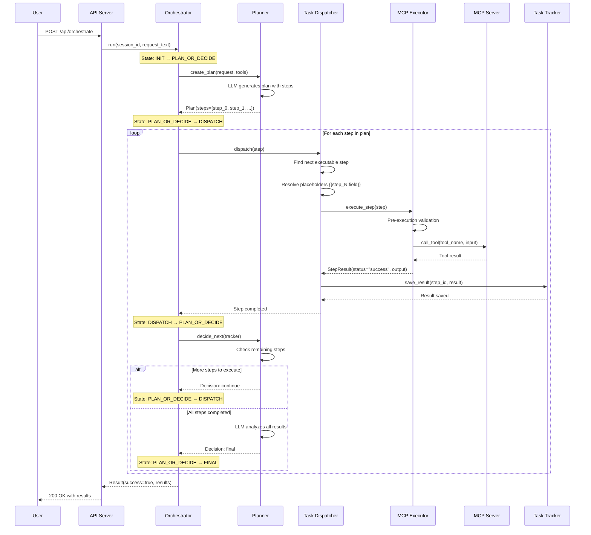
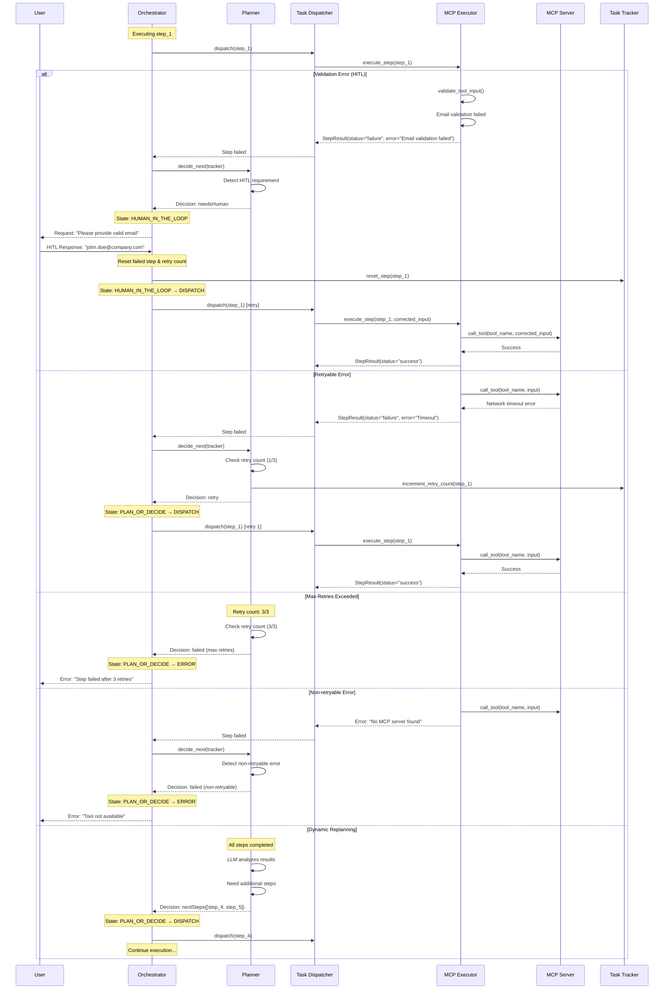

# Personal Assistant Orchestration Service

LangGraph-based orchestration service with real MCP agent integration and multi-LLM support.

## Features

✨ **5 MCP Agent Servers** - Mail, Calendar, Jira, Calculator, and RPA agents
🤖 **Multi-LLM Support** - Works with Anthropic Claude, OpenAI GPT, and OpenRouter
🎯 **LangGraph Orchestration** - Robust state machine for task execution
🌐 **Modern Web UI** - Beautiful interface with configurable LLM settings
📡 **REST API** - FastAPI-based API for programmatic access
🔧 **Flexible Configuration** - Configure LLM provider, model, and base URL through UI

## Quick Start

### 1. Installation

```bash
# Clone the repository
git clone <repository-url>
cd PersonalAssistant

# Install dependencies
pip install -r requirements.txt
```

### 2. Configuration

You can configure the LLM provider in two ways:

#### Option 1: Using the Web UI (Recommended)
1. Start the server (see step 3 below)
2. Open http://localhost:8000
3. Go to the "Settings" tab
4. Configure your LLM provider, API key, model, and optionally base URL
5. Click "Test Connection" to verify, then "Save Settings"

#### Option 2: Using Environment Variables
Create a `.env` file:

```bash
cp .env.example .env
```

Edit `.env` and configure your LLM provider:

```env
# Choose your LLM provider: anthropic, openai, or openrouter
LLM_PROVIDER=anthropic

# Set your API key
ANTHROPIC_API_KEY=your_api_key_here
# OPENAI_API_KEY=your_openai_key_here
# OPENROUTER_API_KEY=your_openrouter_key_here

# Choose your model
LLM_MODEL=claude-3-5-sonnet-20241022
# For OpenAI: gpt-4-turbo-preview, gpt-4, gpt-3.5-turbo
# For OpenRouter: anthropic/claude-3.5-sonnet, openai/gpt-4-turbo

# Optional: Override the default API endpoint URL
# LLM_BASE_URL=https://custom-endpoint.example.com/v1
```

### 3. Start MCP Servers (Optional but Recommended)

#### Linux/Mac:
```bash
# Start all MCP servers
./start_mcp_servers.sh

# Check server status
./status_mcp_servers.sh

# Stop all servers
./stop_mcp_servers.sh
```

#### Windows:
```cmd
# Start all MCP servers
start_mcp_servers.bat
# or
python start_mcp_servers.py

# Check server status
status_mcp_servers.bat
# or
python status_mcp_servers.py

# Stop all servers
stop_mcp_servers.bat
# or
python stop_mcp_servers.py
```

See [README_MCP_SERVERS.md](README_MCP_SERVERS.md) for detailed MCP server management.

### 4. Run the Service

#### Linux/Mac (Development mode with hot reload):
```bash
./start.sh
```

#### Linux/Mac (Production mode):
```bash
./start.sh --prod
```

#### Windows:
```cmd
start.bat
```

#### Manual:
```bash
# Development mode (hot reload enabled)
DEV_MODE=true python src/api_server.py

# Production mode
DEV_MODE=false python src/api_server.py
```

**Development Mode Features:**
- ⚡ Hot reload: Code changes automatically restart the server
- 🔄 Frontend changes are instantly reflected (no manual refresh needed)
- 📝 Watches both `src/` and `frontend/` directories

### 5. Access the Web UI

Open your browser and navigate to:
- **Web UI**: http://localhost:8000
- **API Docs**: http://localhost:8000/docs
- **Health Check**: http://localhost:8000/api/health

## Architecture

### Project Structure

```
PersonalAssistant/
├── frontend/                  # Frontend files (HTML, CSS, JS)
│   ├── index.html            # Main web UI
│   └── static/
│       ├── styles.css        # Styles
│       └── app.js            # Frontend logic
├── src/                      # Backend source code
│   ├── orchestration/
│   │   ├── __init__.py
│   │   ├── types.py          # Type definitions
│   │   ├── config.py         # ConfigLoader
│   │   ├── tracker.py        # TaskTracker
│   │   ├── planner.py        # Planner (Multi-LLM)
│   │   ├── llm_client.py     # LLM client abstraction
│   │   ├── dispatcher.py     # TaskDispatcher
│   │   ├── mcp_executor.py   # MCP Executor (STDIO)
│   │   ├── listener.py       # ResultListener
│   │   ├── settings_manager.py # Settings manager with encryption
│   │   └── orchestrator.py   # Main Orchestrator
│   └── api_server.py         # FastAPI server
├── mcp_servers/              # MCP agent servers
│   ├── mail_agent/
│   │   └── server.py         # Mail MCP server
│   ├── calendar_agent/
│   │   └── server.py         # Calendar MCP server
│   ├── jira_agent/
│   │   └── server.py         # Jira MCP server
│   ├── calculator_agent/
│   │   └── server.py         # Calculator MCP server
│   └── rpa_agent/
│       └── server.py         # RPA MCP server
├── data/                     # Data directory (auto-created)
│   ├── settings.db           # User settings database
│   └── .encryption_key       # Encryption key for API keys
├── logs/                     # Log directory (auto-created)
│   ├── mcp/                  # MCP server logs
│   └── pids/                 # MCP server PID files
├── start.sh                  # Linux/Mac startup script
├── start.bat                 # Windows startup script
├── start_mcp_servers.py      # Start all MCP servers (Python)
├── stop_mcp_servers.py       # Stop all MCP servers (Python)
├── status_mcp_servers.py     # Check MCP server status (Python)
├── start_mcp_servers.sh      # Start all MCP servers (Linux/Mac)
├── stop_mcp_servers.sh       # Stop all MCP servers (Linux/Mac)
├── status_mcp_servers.sh     # Check MCP server status (Linux/Mac)
├── start_mcp_servers.bat     # Start all MCP servers (Windows)
├── stop_mcp_servers.bat      # Stop all MCP servers (Windows)
├── status_mcp_servers.bat    # Check MCP server status (Windows)
├── README_MCP_SERVERS.md     # MCP server management guide
├── README_DATABASE.md        # Database management guide
├── requirements.txt
├── .env.example
├── .gitignore
└── README.md
```

### Core Components

1. **Frontend** (`frontend/`)
   - Modern, responsive web UI
   - LLM settings configuration
   - Real-time request execution
   - Example requests for quick testing

2. **API Server** (`src/api_server.py`)
   - FastAPI-based REST API
   - Serves frontend static files
   - Handles orchestration requests
   - Manages user settings

3. **Orchestrator** (`src/orchestration/orchestrator.py`)
   - LangGraph-based state machine
   - Coordinates all components
   - Manages execution flow

4. **Planner** (`src/orchestration/planner.py`)
   - Multi-LLM support (Claude, GPT, OpenRouter)
   - Creates execution plans
   - Makes decisions based on results

5. **MCPExecutor** (`src/orchestration/mcp_executor.py`)
   - Connects to real MCP servers via STDIO
   - Dynamically discovers available tools
   - Executes MCP tools

6. **Settings Manager** (`src/orchestration/settings_manager.py`)
   - **SQLite database** for persistent storage (`data/settings.db`)
   - **Encrypted API key storage** (Fernet encryption)
   - Per-user/tenant configuration
   - Stores: provider, API key, model, base URL
   - See [README_DATABASE.md](README_DATABASE.md) for details

### State Machine Flow

```
INIT → PLAN_OR_DECIDE → DISPATCH → PLAN_OR_DECIDE → ... → FINAL
                ↓                      ↓
              ERROR                  ERROR
```

### States
- **INIT**: Initial state
- **PLAN_OR_DECIDE**: Planning or decision making
- **DISPATCH**: Executing plan steps
- **HUMAN_IN_THE_LOOP**: Requires human intervention
- **FINAL**: Task completed
- **ERROR**: Error occurred

### Detailed Orchestration Sequence Diagrams

#### 1. Normal Execution Flow (Success Case)

This diagram shows the happy path where planning and execution succeed without errors:



#### 2. Error Handling and Recovery Flow

This diagram shows how the system handles errors, retries, and human intervention:



#### 3. Key Error Handling Mechanisms

**Pre-execution Validation:**
- Email format validation (blocks placeholder/fake domains)
- Input schema validation
- Unresolved template variable detection
- Returns HITL request if validation fails

**Retry Strategy:**
- Per-step retry tracking with configurable limits (default: 3)
- Non-retryable errors (e.g., "No MCP server found") fail immediately
- Exponential backoff can be configured for network errors

**Human-in-the-Loop (HITL):**
- Triggered by validation failures or ambiguous situations
- Preserves execution state using LangGraph checkpointer
- User provides correction → System resets failed step → Retry with corrected input
- Retry count is reset after HITL correction

**Infinite Loop Prevention:**
- Tracks total decision count (max: 10)
- Prevents runaway loops in complex scenarios
- Forces termination if excessive decision cycles occur

**Dynamic Replanning:**
- After all steps complete, LLM can add more steps based on results
- Enables adaptive task execution
- Example: Search results empty → Add step to retry with different query

## MCP Agent Servers

The service includes 5 fully-functional MCP agent servers:

### 📧 Mail Agent
CRUD operations for email management:
- `send_email` - Send an email
- `read_emails` - Read emails from inbox
- `get_email` - Get specific email by ID
- `delete_email` - Delete an email
- `search_emails` - Search emails by query

### 📅 Calendar Agent
Event management with full CRUD:
- `create_event` - Create a new calendar event
- `read_event` - Read event details
- `update_event` - Update existing event
- `delete_event` - Delete an event
- `list_events` - List events with filters

### 🎫 Jira Agent
Issue tracking and management:
- `create_issue` - Create a new Jira issue
- `read_issue` - Read issue details
- `update_issue` - Update issue status/fields
- `delete_issue` - Delete an issue
- `search_issues` - Search issues by query

### 🔢 Calculator Agent
Mathematical operations:
- `add` - Add numbers
- `subtract` - Subtract numbers
- `multiply` - Multiply numbers
- `divide` - Divide numbers
- `power` - Power operation

### 🤖 RPA Agent
Automation tasks (3 specialized tools):
- `search_latest_news` - Search for latest news articles
- `write_report` - Generate formatted reports
- `collect_attendance` - Collect and aggregate attendance

## Usage Examples

### Web UI

The easiest way to use the service is through the Web UI at http://localhost:8000.

**Manual Request Tab:**
- Enter your request in natural language
- Click "Execute Request" to run
- View results in real-time

**Settings Tab:**
- Configure LLM provider (Anthropic, OpenAI, OpenRouter)
- Set API key (encrypted and stored securely)
- Choose model
- Optionally set custom base URL
- Test connection before saving

Example requests:
- "Send an email to john@example.com about the meeting tomorrow"
- "Create a calendar event for team meeting on Friday at 2 PM"
- "Search for issues assigned to me in Jira"
- "Calculate 25 * 8 + 150"
- "Search for latest AI news and write a brief report"

### REST API

```bash
# Execute a request
curl -X POST http://localhost:8000/api/orchestrate \
  -H "Content-Type: application/json" \
  -d '{
    "request_text": "Send an email to john@example.com with subject Hello",
    "user_id": "test_user",
    "tenant": "test_tenant"
  }'

# Get current settings
curl http://localhost:8000/api/settings?user_id=test_user&tenant=test_tenant

# Save settings
curl -X POST http://localhost:8000/api/settings \
  -H "Content-Type: application/json" \
  -d '{
    "provider": "anthropic",
    "api_key": "your-api-key",
    "model": "claude-3-5-sonnet-20241022",
    "base_url": null,
    "user_id": "test_user",
    "tenant": "test_tenant"
  }'

# Test connection
curl -X POST http://localhost:8000/api/settings/test \
  -H "Content-Type: application/json" \
  -d '{
    "provider": "anthropic",
    "api_key": "your-api-key",
    "model": "claude-3-5-sonnet-20241022"
  }'

# List available tools
curl http://localhost:8000/api/tools

# Health check
curl http://localhost:8000/api/health
```

### Programmatic Usage

```python
import asyncio
from orchestration.orchestrator import Orchestrator

async def main():
    # Initialize orchestrator
    orchestrator = Orchestrator(
        user_id="user_123",
        tenant="my_tenant"
    )

    # Run a request
    result = await orchestrator.run(
        session_id="session_001",
        request_text="Calculate 100 + 50 and send the result via email"
    )

    print(f"Success: {result['success']}")
    print(f"Message: {result['message']}")
    if result.get('results'):
        print(f"Results: {result['results']}")

asyncio.run(main())
```

## LLM Provider Configuration

### Anthropic Claude (Default)

```env
LLM_PROVIDER=anthropic
ANTHROPIC_API_KEY=your_key_here
LLM_MODEL=claude-3-5-sonnet-20241022
```

Available models:
- `claude-3-5-sonnet-20241022` (recommended)
- `claude-3-opus-20240229`
- `claude-3-sonnet-20240229`

### OpenAI GPT

```env
LLM_PROVIDER=openai
OPENAI_API_KEY=your_key_here
LLM_MODEL=gpt-4-turbo-preview
```

Available models:
- `gpt-4-turbo-preview`
- `gpt-4`
- `gpt-3.5-turbo`

### OpenRouter

```env
LLM_PROVIDER=openrouter
OPENROUTER_API_KEY=your_key_here
LLM_MODEL=anthropic/claude-3.5-sonnet
```

Available models:
- `anthropic/claude-3.5-sonnet`
- `openai/gpt-4-turbo`
- `google/gemini-pro`
- And many more...

### Custom Base URL

For custom API endpoints or proxies:

```env
LLM_BASE_URL=https://custom-endpoint.example.com/v1
```

Or configure it in the Settings tab of the Web UI.

## Development

### Development Mode

The service supports hot reload for faster development:

```bash
# Start in development mode (default)
./start.sh

# Or set explicitly
DEV_MODE=true python src/api_server.py
```

**Hot reload watches:**
- `src/` - Backend code changes
- `frontend/` - Frontend HTML/CSS/JS changes

Any changes to these directories will automatically restart the server.

### Code Formatting

```bash
black src/
ruff check src/
```

### Type Checking

```bash
mypy src/
```

### Managing MCP Servers

#### Using Python (Recommended - Cross-platform):
```bash
# Start all MCP servers
python start_mcp_servers.py

# Check status
python status_mcp_servers.py

# Stop all servers
python stop_mcp_servers.py

# View logs
# Linux/Mac:
tail -f logs/mcp/calculator_agent.log
# Windows:
type logs\mcp\calculator_agent.log
```

#### Using Shell Scripts:
```bash
# Linux/Mac:
./start_mcp_servers.sh
./status_mcp_servers.sh
./stop_mcp_servers.sh

# Windows:
start_mcp_servers.bat
status_mcp_servers.bat
stop_mcp_servers.bat
```

See [README_MCP_SERVERS.md](README_MCP_SERVERS.md) for more details.

### Adding a New MCP Server

1. Create a new directory in `mcp_servers/`
2. Implement the MCP server using the `mcp` package
3. Add tools using `@app.list_tools()` and `@app.call_tool()`
4. Register the server in `src/orchestration/mcp_executor.py`

Example:

```python
# mcp_servers/my_agent/server.py
from mcp.server import Server
from mcp.types import Tool, TextContent
from mcp.server.stdio import stdio_server

app = Server("my-agent")

@app.list_tools()
async def list_tools():
    return [
        Tool(
            name="my_tool",
            description="My custom tool",
            inputSchema={...}
        )
    ]

@app.call_tool()
async def call_tool(name: str, arguments: Any):
    # Implementation
    pass
```

## Troubleshooting

### MCP Server Connection Issues

If you see connection errors:
1. Ensure Python 3.11+ is installed
2. Check that all dependencies are installed: `pip install -r requirements.txt`
3. Verify the MCP server paths in `src/orchestration/mcp_executor.py`

### LLM API Errors

If you get API errors:
1. Check your API key is correctly set in Settings or `.env`
2. Verify you have sufficient API credits
3. Check the model name is correct for your provider
4. If using a custom base URL, verify it's accessible

### Port Already in Use

If port 8000 is already in use:
```bash
# Linux/Mac
lsof -ti:8000 | xargs kill -9

# Windows
netstat -ano | findstr :8000
taskkill /PID <PID> /F
```

### Settings Not Persisting

Settings are stored in `data/settings.db`. If settings aren't persisting:
1. Check that the `data/` directory exists and is writable
2. Verify file permissions
3. Check the application logs for database errors

## Key Features

### 1. Real MCP Integration

Uses actual MCP STDIO protocol to communicate with agent servers, providing:
- True agent separation
- CRUD-focused operations
- Extensible architecture

### 2. Multi-LLM Support

Works with multiple LLM providers:
- Easy provider switching via UI or environment variables
- Unified interface across providers
- Support for latest models
- Custom base URL support for proxies and custom endpoints

### 3. LangGraph State Machine

Robust orchestration with:
- Clear state transitions
- Error handling
- Decision making

### 4. Modern Web UI

Beautiful, responsive interface with:
- Real-time feedback
- LLM configuration
- Example requests
- Result visualization

### 5. Secure Settings Management

- Encrypted API key storage
- Per-user/tenant isolation
- SQLite-based persistence
- Environment variable fallback

## Contributing

Contributions are welcome! Please feel free to submit a Pull Request.

## License

MIT

## Acknowledgments

- Built with [LangGraph](https://github.com/langchain-ai/langgraph)
- Uses [MCP (Model Context Protocol)](https://github.com/anthropics/mcp)
- Powered by [FastAPI](https://fastapi.tiangolo.com/)
